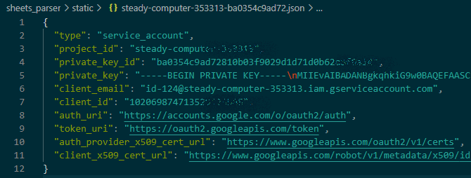

# Google_Sheets_Parser
Получает данные из Google_Sheets таблицы, модифицирует, сохраняет в БД и поддерживает актуальность.
Отслеживает дату доставки и в случае если она просрочена, один раз в день, отправляет сообщение в Telegram
Имеет Web интерфейс содержаший модифицированную таблицу (добавлен столбец с ценой в рублях), а так же кнопки управления обновлением (Запустить / Остановить)

## Локальная установка. 
Для установки: 
* скачайте проект к себе на компьютер 
```bash
    git clone <url repo>
```
* Установите Docker 
```https://www.docker.com/get-started```
* установите виртуальное окружение
```bash
    python3 -m venv venv
```
* Активируйте виртуальное окружение
```bash
    . venv/Scripts/activate
```
* создайте в ```/sheets_parser``` файл ```.env``` с переменными окружения
```python
    DB_ENGINE=<django.db.backends.postgresql>
    DB_NAME=<db_name>  # имя базы данных
    POSTGRES_USER=<db_login>  # логин для подключения к базе данных
    POSTGRES_PASSWORD=<db_password>  # пароль для подключения к БД
    DB_HOST=<db>  # название сервиса
    DB_PORT=<5432>  # порт для подключения к БД
    TELEGRAM_TOKEN=<token>  # Ваш чат телеграм токен
    TELEGRAM_CHAT_ID=<chat_id>  # Ваш чат ID
    KEY_TABLE=18oeulFN2llNidNMF2O-GBRRYK6EycS_IEP9OVyQTe_o  # Идентификатор таблицы Google Sheets (Можно скопировать из URL таблицы)
    KEY_FILE=steady-computer-353313-ba0354c9ad72.json  # Ваш json файл c с настройками авторизации
```
* Скопируйте файл с приватными ключами, для сервисного аккаунта, полученный от Google в папку static.


* Перейдите в папку sheets_parser
```bash
    cd sheets_parser
```

* Выполните сборку образов и запуск контейнеров
```bash
    docker-compose up -d --build
```
* Выполните миграции
```bash
    docker-compose exec backend python manage.py migrate --noinput
```
* Откройте страницу http://127.0.0.1:8000/ в браузере нажмите "Запустить". Начнется
запустится автоматическое обновление записей из таблицы Google Heets в базу данных.
Для просмотра обновленных данных перезагрузите страницу


## Используемые технологии

Python, Django, Docker, Docker-compose, Git

Библиотеки:
gspread - Библиотека для обмена данными с Google Sheets
threading - Модуль создает высокоуровневые потоковые интерфейсы
python-telegram-bot - Отправка сообщений в телеграм
etree.ElementTree - Встроенная библиотека, через нее парсим XML файл с курсами валют


## Автор
Кириленко Андрей
